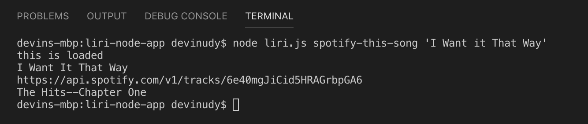
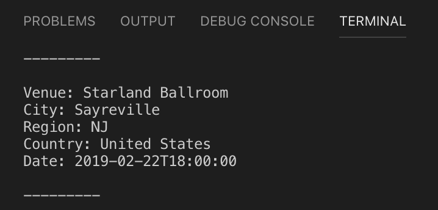

# Liri.js
## Objective
* Create a "SIRI"-like interface (LIRI). 
    * LIRI will be a Language Interpretation and Recognition Interface
    * Use the command line for the app to take in parameters and return data
## Examples
* `node liri.js spotify-this-song '<song name here>'`
    
    * This command will display:
        * The name of the song
        * A preview link of the song from Spotify
        * The album that the song is from
* `node liri.js concert-this <artist/band name here>`
    
    * This command will display:
        * Name of the Venue
        * Venue Location
        * Date of the Event